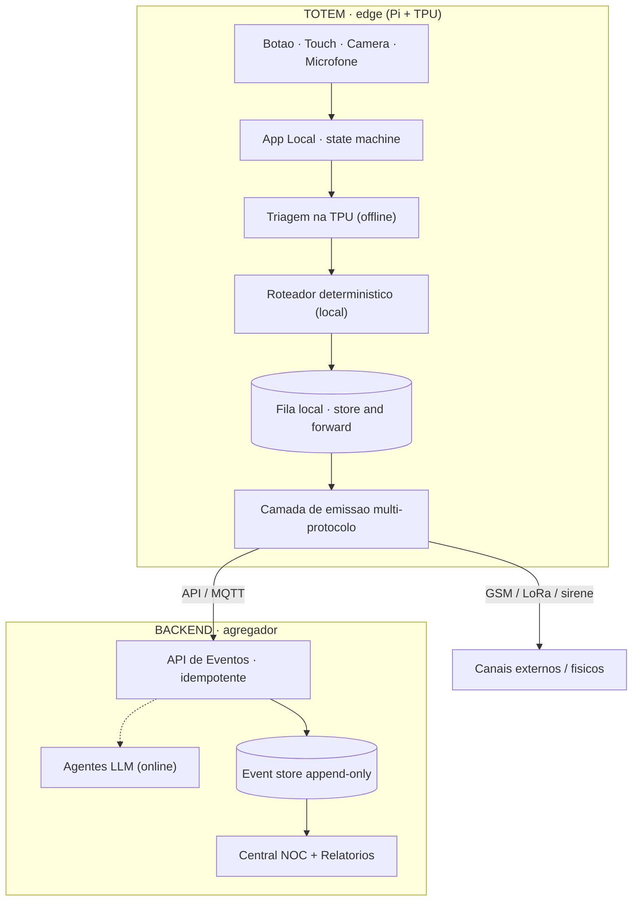
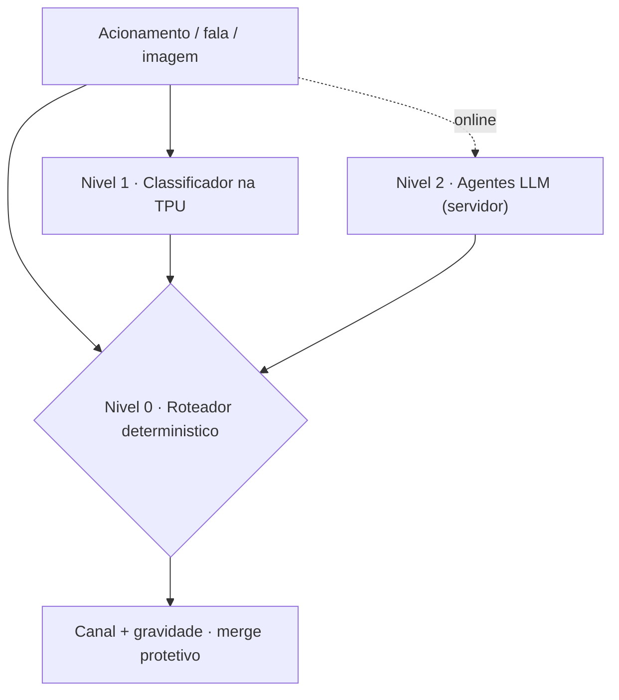
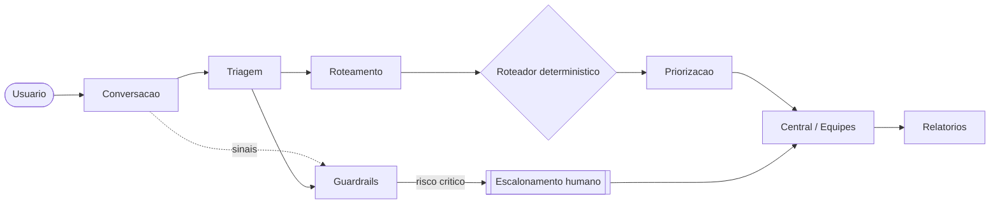
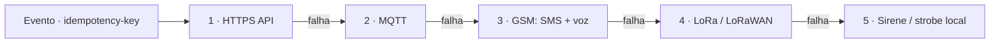
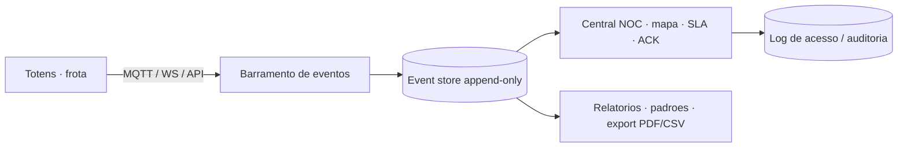
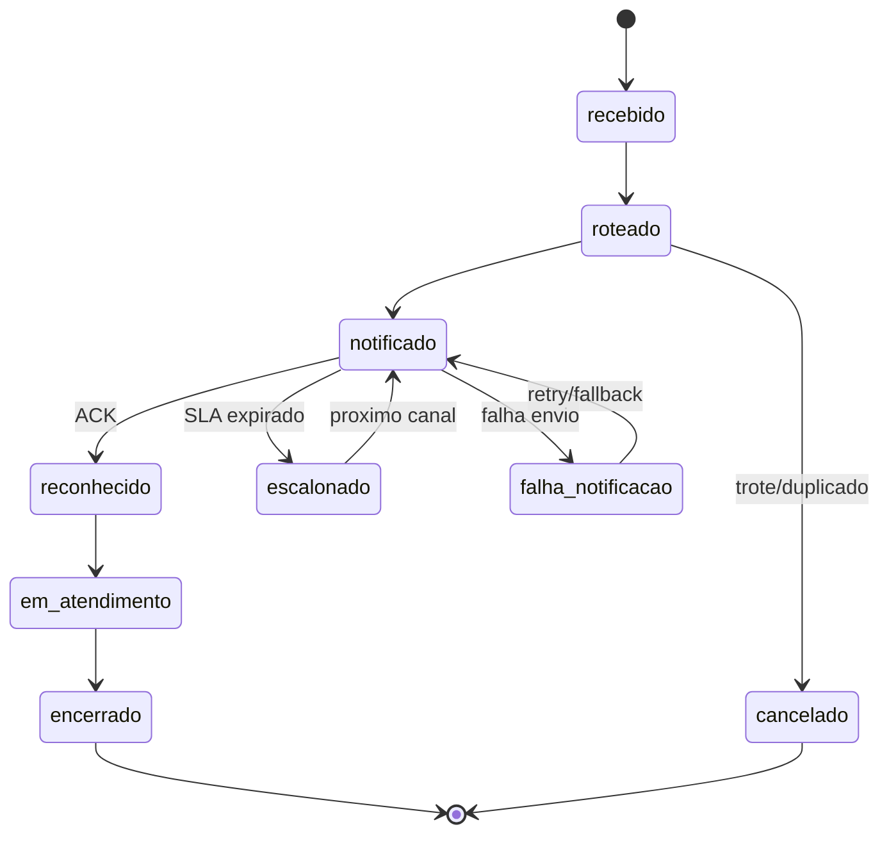
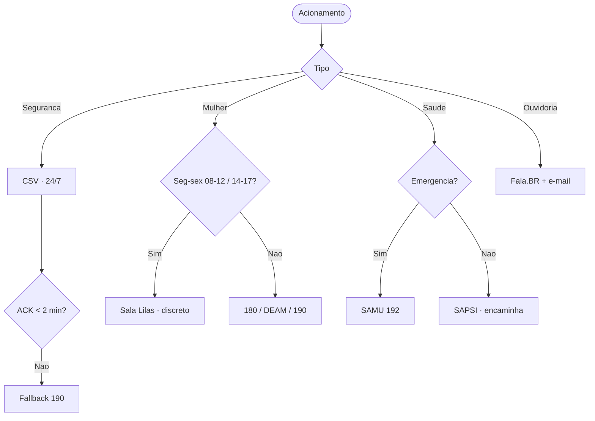

# P.O.T.O — Totem Inteligente de Emergência (UFPI)
## Projeção Final — arquitetura-alvo

> **P.O.T.O** · Plataforma de Orientação, Triagem e Ouvidoria
> Campus Ministro Petrônio Portella · Teresina–PI · Documento de visão · Atualizado em 14/06/2026
>
> Arquitetura-alvo completa: triagem offline em TPU, emissão multi-protocolo, central de monitoramento e relatórios.
> O recorte de entrega inicial está em [`relatorio-prototipo.md`](relatorio-prototipo.md). Versão estilizada: [`relatorio-poto.html`](relatorio-poto.html).

---

## Sumário

1. [Contexto e objetivos](#1-contexto-e-objetivos)
2. [Validação institucional](#2-validação-do-contexto-institucional)
3. [Matriz de requisitos](#3-matriz-de-requisitos)
4. [Casos de uso](#4-casos-de-uso)
5. [Arquitetura de componentes](#5-arquitetura-de-componentes)
6. [Triagem em dois níveis (TPU + LLM)](#6-triagem-em-dois-níveis-edge-tpu--llm-online)
7. [Agentes de triagem e conversação](#7-agentes-de-triagem-e-conversação)
8. [Camada de emissão multi-protocolo](#8-camada-de-emissão-multi-protocolo)
9. [Central de monitoramento e relatórios](#9-central-de-monitoramento-e-relatórios)
10. [Topologias do nó de borda](#10-topologias-do-nó-de-borda)
11. [Contrato da API de Eventos](#11-contrato-da-api-de-eventos)
12. [Máquina de estados e roteamento](#12-máquina-de-estados-e-roteamento)
13. [Decisões de arquitetura (ADRs)](#13-decisões-de-arquitetura-adrs)
14. [Segurança e conformidade](#14-segurança-privacidade-e-conformidade)
15. [Contatos institucionais](#15-contatos-institucionais-validados)
16. [Riscos e mitigações](#16-riscos-e-mitigações)
17. [Roadmap e pendências](#17-roadmap-e-pendências)

---

## 1. Contexto e objetivos

A UFPI mantém serviços de acolhimento, prevenção e resposta a situações de risco no Campus Ministro Petrônio Portella. O **P.O.T.O** é um totem inteligente de emergência para pontos estratégicos do campus, com botão de pânico físico e interface digital, voltado a:

- Acionamento rápido de **segurança universitária** (CSV/PREUNI);
- Acolhimento em casos de **assédio e violência contra a mulher** (Sala Lilás);
- Orientação de **saúde e apoio psicossocial** (SAPSI/PRAEC, HU-UFPI, rede SUS);
- Entrada para **escuta institucional e manifestações formais** (Ouvidoria / Fala.BR).

> **Este documento é a projeção final** (arquitetura-alvo). O recorte mínimo para validação em bancada — 1 totem, sem TPU e sem gabinete — está no [relatório do protótipo](relatorio-prototipo.md).

---

## 2. Validação do contexto institucional

Fontes oficiais (UFPI, HU-Brasil/Ebserh) e notícias institucionais, jun/2026.

| Serviço | Status | Observação relevante |
|---|---|---|
| **Sala Lilás Janaína da Silva Bezerra** | ✅ Confirmada | Inaugurada em 28/08/2025, no CCS ao lado da Ouvidoria. Equipe de psicóloga, assistente social e advogada. Parceria UFPI + SSP-PI, que reforça o modo discreto. |
| **CSV / PREUNI** | ✅ Confirmada | (86) 3215-5591, Bloco 07, Ininga. Núcleo de segurança interna do campus. |
| **SAPSI / PRAEC** | ⚠️ Com ressalva | Agendamento mensal com vagas limitadas. Não é plantão de urgência — o totem só deve encaminhar pedido de contato. |
| **Ouvidoria / Fala.BR** | ✅ Confirmada | (86) 3237-2104, ouvidoria@ufpi.br. Instituída pelo Ato nº 858/09. |
| **HU-UFPI (Ebserh)** | ✅ Confirmada | Referência de articulação, não canal primário de emergência (esse papel é do SAMU 192). |

---

## 3. Matriz de requisitos

Urgência U1 (crítico), U2 (operação), U3/U4 (evolução). Itens 🆕 entraram com as perspectivas de TPU, emissão multi-protocolo e central.

### 3.1 Críticos (U1)

| ID | Requisito | Descrição |
|---|---|---|
| RC-01 | Acionamento rápido | Botão físico + touch com ícones legíveis; baixa carga cognitiva. |
| RC-02 | Triagem inicial | Segurança, Saúde, Atendimento à Mulher, Ouvidoria/Orientação. |
| RC-03 | Encaminhamento automático | Roteamento por trilha + fallback externo (190/192/180). |
| RC-04 | Confirmação discreta | Feedback visual imediato; silencioso/neutro em violência de gênero. |
| RC-05 | Registro mínimo e seguro | Data/hora, ID do totem, localização e tipo. Minimização LGPD. |
| RC-06 | Modo silencioso / discreto | Fluxo sem áudio e texto neutro quando o agressor possa estar próximo. |
| RC-07 | Confirmação de entrega (ACK) | Reconhecimento por um responsável; sem ACK no prazo → escalonamento. |
| RC-08 | Store-and-forward | Evento gravado localmente antes do envio; confirmação pelo enfileiramento. |
| RC-09 | Mitigação de trote | Anti-falso-positivo no touch sem bloquear o botão físico. |
| RC-10 🆕 | A/V com processamento no edge | Áudio/vídeo processados localmente (TPU); só eventos/metadados saem. O bruto não é transmitido sem governança (privacy-by-design). |

### 3.2 Operação (U2)

| ID | Requisito | Descrição |
|---|---|---|
| RO-01 | Identificação do totem | ID único + cadastro de localização. |
| RO-02 | Painel / Central | Web autenticado, tempo real, filtros por tipo/local/status. |
| RO-03 | Redundância de comunicação | IP institucional + 4G/5G com fallback. |
| RO-04 | Classificação por gravidade | Risco imediato / potencial / orientação. |
| RO-05 | Atendimento e encerramento | Estados + observação interna auditável. |
| RO-06 | Interface acessível | Contraste, fonte mínima, botões amplos, navegação simples. |
| RO-07 | Roteamento por horário | Sensível à disponibilidade (Lilás/SAPSI seg–sex) com fallback honesto. |
| RO-08 | Heartbeat / saúde | Sinal periódico; ausência → alerta operacional. |
| RO-09 | SLA e escalonamento | ACK por gravidade; expiração aciona próximo canal + admin. |
| RO-10 🆕 | Emissão multi-protocolo | Escada de canais (API → MQTT → GSM → LoRa → sirene) com dedupe e ACK por canal (ver §8). |
| RO-11 🆕 | Central + auditoria | Monitoramento de frota, event store append-only e log de acesso (ver §9). |

### 3.3 Evolução (U3/U4)

| ID | Requisito | Descrição |
|---|---|---|
| RE-01 | Captura A/V sob política | Retenção/uso após governança, com consentimento. |
| RE-02 | Áudio/vídeo bidirecional | Voz/vídeo totem↔atendente, com infra e respaldo. |
| RE-03 | Histórico e padrões | Análise por local/horário/tipo. |
| RE-04 | Agentes de IA | Triagem, conversação, priorização com supervisão humana (ver §7). |
| RE-05 | Integração institucional | Futuro (ex.: "Minha UFPI"), respeitando privacidade. |
| RE-06 🆕 | Triagem offline em TPU | Inferência no edge (classificação/visão/áudio) sem rede (ver §6). |
| RE-07 🆕 | Relatórios analíticos exportáveis | Padrões e indicadores em PDF/CSV para gestão (ver §9). |

---

## 4. Casos de uso

### UC-01 — Segurança no campus (CSV/PREUNI)
Acionamento → registro local → alerta à CSV → classificação → ronda. Disponibilidade 24/7; fallback **190**.

### UC-02 — Atendimento à Mulher (Sala Lilás)
Seleção → modo discreto → alerta à Lilás com ID e horário → resposta (WhatsApp, presencial, rede). Seg–sex 08–12/14–17; fora do horário, orientação discreta + 180/190/DEAM.

### UC-03 — Saúde e apoio psicossocial
SAPSI (não emergencial): totem orienta e encaminha pedido, sem prometer atendimento. Emergência: SAMU 192 / pronto-atendimento; HU-UFPI como referência.

### UC-04 — Escuta institucional (Ouvidoria)
Seleção → explicação do Fala.BR → QR code + botão de pedido de contato ao e-mail. Assíncrono.

---

## 5. Arquitetura de componentes

Na projeção final o edge ganha **inferência local (TPU)** e a emissão deixa de depender só da API. O backend passa a ser o **agregador/central**, não o cérebro da triagem.


*Figura 1 — Arquitetura-alvo: triagem no edge, emissão multi-protocolo, central agregadora.*

**Princípios:**
1. **Triagem no edge (TPU)** — roteamento imediato sem rede; o LLM no servidor apenas enriquece (§6).
2. **Emissão multi-protocolo** — escada de canais com dedupe por idempotency-key (§8).
3. **Central agregadora** — frota, SLA, ACK, auditoria e relatórios (§9).
4. **Privacy-by-design** — A/V processado no edge; só eventos saem (RC-10).
5. **Roteador determinístico** — a rede de segurança, independente de IA e de rede.

---

## 6. Triagem em dois níveis (edge TPU + LLM online) 🆕

A TPU não roda um LLM completo; ela roda **classificadores compactos**. Por isso a triagem é estratificada — quanto mais baixo o nível, mais disponível e mais determinístico.

| Nível | O que faz | Onde roda | Disponibilidade |
|---|---|---|---|
| **0 · Determinístico** | Botões + regras de roteamento (tipo × horário). | Edge (CPU) | Sempre — independe de IA e rede |
| **1 · Classificador edge** | Intenção textual, *keyword spotting* de áudio, eventos de visão (queda, aglomeração). | Edge (TPU, TFLite/Hailo) | Offline, baixa latência |
| **2 · Agentes LLM** | Acolhimento rico, refinamento e justificativa do encaminhamento. | Servidor (Ollama/LangGraph) | Quando online |


*Figura 2 — Estratificação da triagem. O nível superior nunca rebaixa a proteção do inferior.*

> **Merge protetivo:** em crise detectada por qualquer nível, vale sempre a rota mais protetiva. Já implementado no protótipo entre heurística e LLM; na projeção final, estende-se ao classificador da TPU.

---

## 7. Agentes de triagem e conversação

Camada de IA do nível 2. Todos operam como apoio à decisão humana e com **fallback determinístico**.

| Agente | Papel |
|---|---|
| **Conversação / Acolhimento** | Diálogo inicial acolhedor; adapta-se ao modo discreto; coleta o mínimo. |
| **Triagem** | Classifica o tipo e estima a gravidade inicial. |
| **Segurança / Guardrails** | Detecta sinais críticos; força escalonamento humano; vigia LGPD. |
| **Roteamento (sugestão)** | Sugere o canal; decisão final no roteador determinístico. |
| **Priorização** | Ordena a fila da central por risco + SLA. |
| **Apoio a Relatórios** | Padrões por local/horário/tipo; alimenta os relatórios (§9). |
| **Orquestrador** | Coordena os agentes e aplica os checkpoints humanos. |


*Figura 3 — Pipeline de agentes (LangGraph + Ollama, supervisão humana).*

---

## 8. Camada de emissão multi-protocolo 🆕

O alerta deixa de depender de um único caminho. Uma **escada de prioridade** tenta os canais em ordem; o `idempotency-key` evita chamado duplicado e cada canal confirma entrega (ACK).


*Figura 4 — Escada de emissão com fallback.*

| Protocolo | Uso | Componente | Quando |
|---|---|---|---|
| **HTTPS / API** | Caminho primário, rico (payload completo). | Wi-Fi / Ethernet / 4G | Rede IP disponível |
| **MQTT** | Pub/sub para frota + central em tempo real. | Broker (ex.: Mosquitto) | Rede IP, frota |
| **GSM (SMS + voz)** | Alerta sem IP; autodiscagem para plantão. | HAT LTE (ex.: SIM7600) | Queda de rede de dados |
| **LoRa / LoRaWAN** | Payload mínimo, alcance de km, ultra-resiliente. | Módulo SX1276 + gateway | Sem wifi/4G |
| **Saída física** | Sirene/strobe local ou alarme do campus. | HAT de relé / contato seco | Dissuasão imediata |

> No protótipo, apenas o caminho 1 (API) é implementado; os demais são **upgrades** da projeção final.

---

## 9. Central de monitoramento e relatórios 🆕

O painel evolui para uma **central tipo NOC**: visão de frota, fila de chamados com cronômetro de SLA, ACK e trilha de auditoria. Toda atividade é registrada num **event store append-only** (à prova de adulteração), com **log de acesso** (quem viu o quê — exigência de LGPD para dados sensíveis).


*Figura 5 — Fluxo de dados da central e dos relatórios.*

| Capacidade | Descrição |
|---|---|
| Visão de frota | Mapa dos totens, saúde (heartbeat, bateria, tamper, conectividade). |
| Fila operacional | Chamados ativos por gravidade, com cronômetro de SLA e escalonamento. |
| Auditoria | Histórico imutável de estados + registro de acesso por perfil (RBAC). |
| Relatórios | Indicadores e padrões (local/horário/tipo), export PDF/CSV, gerados pelo agente de relatórios. |

---

## 10. Topologias do nó de borda

| Abordagem | Prós | Contras |
|---|---|---|
| **1 · Pi magra (thin)** | Lógica num só lugar; pouco segredo no campo; barata. | Roteamento depende de rede (store-and-forward evita perda, pode atrasar). |
| **2 · Pi + TPU (standalone)** | Triagem e roteamento offline; resiliência máxima; privacidade (A/V não sai). | Modelos no edge exigem MLOps (conversão, versionamento, atualização remota). |
| **3 · Sem Pi (econômico)** | Tablet kiosk ou ESP32 para casos simples. | Sem inferência local; UI/robustez limitadas. |

> **Protótipo (ADR-001/004):** Abordagem 1 (thin/online), triagem no servidor.
> **Projeção final (ADR-006):** Abordagem 2 (Pi + TPU), triagem offline como fallback resiliente.

---

## 11. Contrato da API de Eventos

Base `https://<backend>/api/v1`. HTTPS/TLS; autenticação do totem por mTLS ou token.

### POST /eventos

```json
{
  "evento_id": "550e8400-e29b-41d4-a716-446655440000",
  "totem_id": "TOTEM-CCS-01",
  "tipo_ocorrencia": "seguranca",
  "modo": "normal",
  "origem_acionamento": "botao_fisico",
  "timestamp_local": "2026-06-14T15:32:10-03:00",
  "firmware_versao": "1.0.0",
  "assinatura": "<hmac-sha256>"
}
```

- **Idempotência:** mesmo `evento_id` → mesmo `chamado_id` (vale entre canais de emissão).
- **Modo discreto** força `feedback_sonoro:false` e `tela_neutra:true`.
- **Erros:** 401 auth · 409 idempotência · 422 validação · 503 indisponível (fila local).

| Método | Rota | Uso |
|---|---|---|
| POST | `/eventos` | Acionamento (idempotente). |
| POST | `/transcrever` | Áudio → texto (STT). |
| POST | `/triagem` | Triagem conversacional (agentes). |
| POST | `/totens/{id}/heartbeat` | Sinal de vida + status. |
| GET | `/chamados` | Lista da central; filtros tipo/status/gravidade. |
| POST | `/chamados/{id}/ack` | Reconhecimento (SLA). |
| PATCH | `/chamados/{id}` | Mudar estado / observação. |

---

## 12. Máquina de estados e roteamento

### 12.1 Ciclo de vida do chamado


*Figura 6 — Ciclo de vida do chamado.*

### 12.2 Decisão de roteamento


*Figura 7 — Árvore de decisão do roteador.*

| Tipo | Horário | Canal primário | Fallback |
|---|---|---|---|
| `seguranca` | 24/7 | CSV — (86) 3215-5591 | 190 |
| `mulher` | seg–sex 08–12/14–17 | Sala Lilás — (86) 99428-7263, discreto | 180/DEAM/190 |
| `saude` (emerg.) | 24/7 | SAMU 192 | HU-UFPI |
| `saude` (não emerg.) | comercial | SAPSI — encaminhar contato | orientação |
| `ouvidoria` | assíncrono | Fala.BR + ouvidoria@ufpi.br | — |

### 12.3 SLA por gravidade

| Gravidade | ACK | Na expiração |
|---|---|---|
| `risco_imediato` | ≤ 2 min | Próximo canal + admin. |
| `risco_potencial` | ≤ 10 min | Próximo canal. |
| `orientacao` | — | Registro assíncrono. |

> SLAs (2/10 min) são proposta de engenharia; dependem da capacidade real de resposta da CSV e da Sala Lilás.

---

## 13. Decisões de arquitetura (ADRs)

| ID | Decisão | Justificativa |
|---|---|---|
| ADR-001 | Protótipo: 1 totem, validação de funcionalidades | Provar fluxo e central com complexidade mínima (sem gabinete/TPU). |
| ADR-002 *(revisto)* | A/V no hardware, captura sob política + processamento no edge | Câmera e microfone são obrigatórios; o bruto não sai sem governança. Reconcilia A/V com LGPD via privacy-by-design. |
| ADR-003 | Backend + central em Python | FastAPI; facilita a camada de IA. Front em Bun/TS. |
| ADR-004 | Protótipo thin/online; final Pi + TPU | Entrega inicial simples; resiliência offline na projeção final. |
| ADR-005 | Edge desacoplado por contrato de evento | Trocar emulador → Pi → Pi+TPU sem tocar no backend. |
| ADR-006 🆕 | Triagem em dois níveis (TPU + LLM) | TPU roda classificadores compactos offline; LLM enriquece online. |
| ADR-007 🆕 | Emissão multi-protocolo com escada de fallback | O alerta não pode depender de um único caminho. |
| ADR-008 🆕 | Central NOC + event store append-only | Monitoramento de frota, auditoria e relatórios exigem trilha imutável. |

---

## 14. Segurança, privacidade e conformidade

- **Privacy-by-design** — A/V processado no edge (TPU); só eventos/metadados saem.
- **Minimização de dados** — só o necessário; sem relatos detalhados no totem.
- **Criptografia** — HTTPS/TLS (preferência mTLS); em repouso quando factível.
- **RBAC + log de acesso** — perfis distintos (CSV, Lilás, SAPSI, Ouvidoria, admin) e registro de quem acessa o quê.
- **LGPD** — aprovação prévia por Ouvidoria, PROJUR e PRAEC; auditoria imutável.
- **Integridade** — tamper, gabinete antivandalismo, assinatura de eventos.

---

## 15. Contatos institucionais validados

| Serviço | Papel | Contato |
|---|---|---|
| CSV / PREUNI | Segurança no campus | (86) 3215-5591 — Bloco 07, Ininga |
| Sala Lilás | Acolhimento à mulher (CCS) | WhatsApp (86) 99428-7263 · ramal 3215-5607 |
| SAPSI / PRAEC | Apoio psicológico | sapsi@ufpi.edu.br · PRAEC (86) 3215-5640 |
| Ouvidoria UFPI | Escuta formal / Fala.BR | (86) 3237-2104 · ouvidoria@ufpi.br |
| HU-UFPI | Articulação em saúde | (86) 3228-5201 · Serviço Social 3228-5336 |
| **Externas** | Fallback | 190 PM · 192 SAMU · 180 Mulher |

---

## 16. Riscos e mitigações

| Risco | Mitigação |
|---|---|
| Trote / acionamento falso | Confirmação 2 toques, rate-limiting, classificação na central. |
| Chamado entregue mas não visto | ACK + SLA + escalonamento automático. |
| Serviço fora do horário | Roteamento por horário + fallback honesto. |
| Queda de rede | Store-and-forward + escada de emissão (MQTT/GSM/LoRa). |
| Modelo do edge desatualizado | MLOps: versionamento e atualização remota assinada dos modelos da TPU. |
| Exposição da vítima | Modo discreto, A/V processado no edge, mensagens neutras. |
| Expectativa no SAPSI | Totem só encaminha pedido; mensagem clara. |

---

## 17. Roadmap e pendências

**Roadmap até a projeção final**
1. Protótipo: backend + central + totem (Pi, cam, mic) — [ver relatório](relatorio-prototipo.md).
2. A/V bidirecional validado com os destinos de triagem.
3. Triagem no edge (TPU): conversão e versionamento de modelos.
4. Emissão multi-protocolo (MQTT → GSM → LoRa → sirene).
5. Central NOC + event store append-only + relatórios.
6. Endurecimento: RBAC, auditoria, tamper, MLOps.

**Pendências de governança**
- Validar cada número e ponto focal.
- Confirmar se os destinos recebem vídeo (UC bidirecional).
- Aprovação dos fluxos sensíveis e da política de A/V.
- Autorização da PREUNI para instalação.
- Definição de retenção/uso de evidências (PROJUR).
- SLA realista por serviço.

---

*P.O.T.O · Plataforma de Orientação, Triagem e Ouvidoria — projeção final (arquitetura-alvo). Recorte de entrega inicial em [`relatorio-prototipo.md`](relatorio-prototipo.md).*
