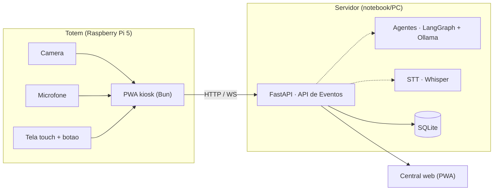
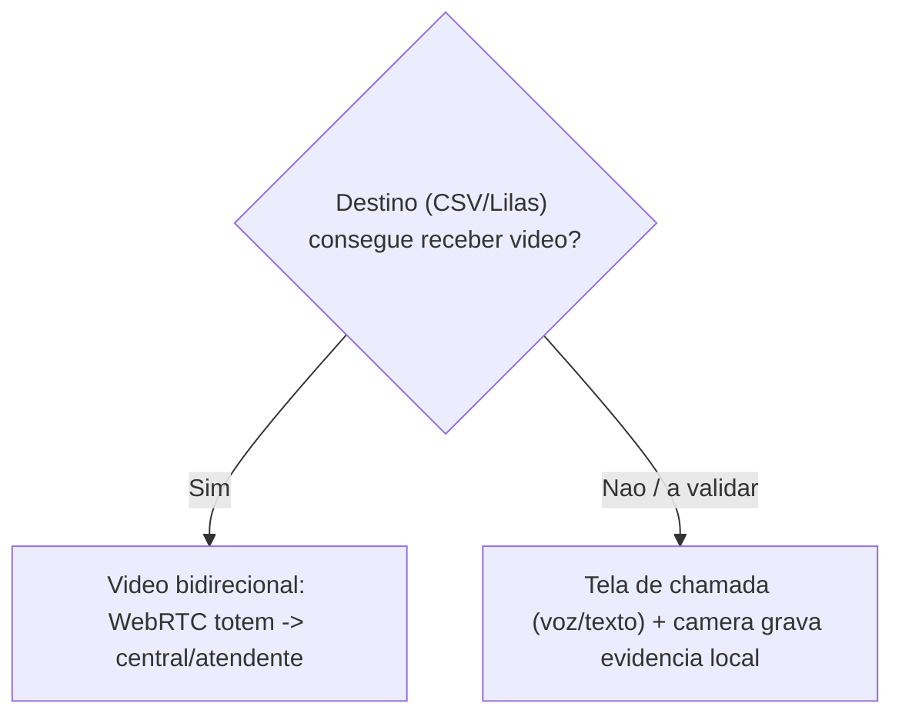

# P.O.T.O — Protótipo (Entrega Inicial)
## 1 totem · validação de funcionalidades

> **P.O.T.O** · Plataforma de Orientação, Triagem e Ouvidoria
> Campus Ministro Petrônio Portella · Teresina–PI · Documento de execução · Atualizado em 14/06/2026
>
> Recorte mínimo para validar funcionalidades em bancada: um totem com controlador, câmera e microfone, emissão via API e central web. Sem TPU e sem gabinete nesta fase.
> Arquitetura-alvo em [`relatorio-poto.md`](relatorio-poto.md). Versão estilizada: [`relatorio-prototipo.html`](relatorio-prototipo.html).

---

## Sumário

1. [Objetivo da entrega](#1-objetivo-da-entrega-inicial)
2. [Escopo — dentro e fora](#2-escopo--dentro-e-fora)
3. [Funcionalidades a validar](#3-funcionalidades-a-validar)
4. [Arquitetura do protótipo](#4-arquitetura-do-protótipo)
5. [Lista de componentes (BOM)](#5-lista-de-componentes-bom)
6. [Vídeo: bidirecional ou evidência](#6-vídeo-bidirecional-ou-evidência)
7. [Emissão de alerta](#7-emissão-de-alerta)
8. [Critérios de aceite](#8-critérios-de-aceite)
9. [Plano até a entrega](#9-plano-até-a-entrega)

---

## 1. Objetivo da entrega inicial

Demonstrar, em **um único totem de bancada**, o fluxo ponta-a-ponta do P.O.T.O: acionamento → triagem (botão/touch, texto e voz) → roteamento → chamado na **central** em tempo real, com modo discreto e confirmação. O foco é **validar funcionalidades**, não a robustez física.

> Decisões desta fase: **sem TPU** (triagem roda no servidor com Ollama), **sem gabinete** (montagem aberta para apresentação), **emissão só via API HTTP**. Resiliência offline, TPU, multi-protocolo e central NOC completa ficam na [projeção final](relatorio-poto.md).

---

## 2. Escopo — dentro e fora

**Dentro (protótipo)**
- 1 totem: controlador + câmera + microfone + tela touch.
- Triagem por botão/touch, texto e voz (STT).
- Agentes (LangGraph + Ollama) no servidor.
- Emissão via **API HTTP** + fila local (store-and-forward).
- Central web: lista em tempo real, ACK, mudança de estado.
- Modo discreto (trilha mulher).
- Captura de vídeo (chamada e/ou evidência — ver §6).

**Fora (vai para a projeção final)**
- Triagem offline em TPU (Hailo/Coral).
- Gabinete antivandalismo, tamper, no-break.
- Emissão MQTT / GSM / LoRa / sirene.
- Central NOC com mapa de frota e relatórios PDF/CSV.
- mTLS, RBAC completo e auditoria imutável.
- Frota (vários totens) e atualização remota.

---

## 3. Funcionalidades a validar

| Req. | Funcionalidade | Como validar |
|---|---|---|
| RC-01 | Botão de pânico físico + touch | Pressionar o botão (GPIO) e tocar os ícones; chamado aparece na central. |
| RC-02 | Triagem por trilha | Segurança / Mulher / Saúde / Ouvidoria roteiam ao canal correto. |
| RE-04 | Chat por texto (agentes) | Descrever situação → triagem sugere tipo/gravidade com merge protetivo. |
| RE-04 | Chat por voz (STT) | Gravar fala → transcrição → triagem. Animação e logs do microfone. |
| RE-04 | Conversa hands-free (voz) | VAD → Whisper → agente (pergunta ou conclui) → resposta por TTS. Diálogo em tela; conclui na hora em sinal crítico. |
| RC-06 | Modo discreto | Trilha mulher: sem som, tela neutra, mensagem genérica. |
| RC-08 | Store-and-forward | Desligar a rede: evento enfileira e sincroniza ao reconectar (idempotente). |
| RO-02 | Central em tempo real | Chamado novo aparece via WebSocket; ACK e troca de estado refletem na hora. |
| RE-02 | Vídeo (chamada/evidência) | Ver §6 — depende da validação com os destinos. |

---

## 4. Arquitetura do protótipo

*Figura 1 — Protótipo: totem fino (Pi) + servidor com agentes/STT + central web.*

Stack já implementada: `backend/` (FastAPI, uv), `frontend/` (Bun: totem + central). O totem é apenas cliente da API — o mesmo backend servirá o Pi+TPU na projeção final, sem reescrita.

---

## 5. Lista de componentes (BOM)

Preços aproximados no varejo BR, jun/2026, para referência de ordem de grandeza. **(obrigatório)** marca os itens exigidos: controlador, câmera e microfone.

### 5.1 Núcleo do totem

| Item | Modelo / versão sugerida | Papel | Aprox. (R$) |
|---|---|---|---|
| Controlador **(obrigatório)** | **Raspberry Pi 5 — 8 GB** | Computador do totem (kiosk + cliente da API) | 750–950 |
| Câmera **(obrigatório)** | **Raspberry Pi Camera Module 3** (Wide, CSI) *ou* webcam USB UVC (Logitech C920) | Vídeo de chamada / evidência. A C920 já inclui microfone | 250–500 |
| Microfone **(obrigatório)** | **Mic USB** (array compacto) *ou* MEMS I2S (SPH0645) — dispensável se usar a C920 | Captação de voz para o STT | 80–250 |
| Tela / touch | Raspberry Pi Touch Display 2 (7") *ou* monitor HDMI + touch USB | Interface do kiosk | 500–900 |
| Botão de pânico | Botão arcade 60 mm + jumpers (GPIO) | Acionamento físico (RC-01) | 30–60 |
| Alto-falante | Mini speaker USB ou 3,5 mm | Feedback sonoro (quando não discreto) | 40–90 |

### 5.2 Itens de operação (para ligar e rodar)

| Item | Modelo / versão | Aprox. (R$) |
|---|---|---|
| Fonte | Fonte oficial USB-C PD 27 W (Pi 5) | 90–140 |
| Armazenamento | microSD 64 GB A2 (classe A2/U3) | 50–90 |
| Refrigeração | Active Cooler oficial do Pi 5 | 50–80 |
| Cabos | CSI/FFC para a câmera, HDMI, USB | 40–80 |
| **Total estimado (1 totem, sem gabinete)** | | **≈ R$ 1,9k–4,2k** |

### 5.3 Upgrades (projeção final, fora do protótipo)

| Item | Modelo / versão | Para quê |
|---|---|---|
| TPU | Raspberry Pi AI Kit (Hailo-8L, 13 TOPS, M.2) *ou* Google Coral USB | Triagem offline no edge |
| Celular | HAT 4G/LTE SIM7600 | SMS + voz + dados de fallback |
| LoRa | Módulo SX1276/RFM95 + gateway | Alerta ultra-resiliente |
| Saída física | HAT de relé / contato seco | Sirene/strobe ou alarme do campus |
| Energia | UPS HAT + baterias 18650 | No-break contra queda de energia |
| Proteção | Gabinete metálico antivandalismo + sensor tamper | Instalação em campo |

> Recomendação de compra para a câmera: se o objetivo é **vídeo bidirecional plug-and-play**, a webcam USB (C920) simplifica (UVC + mic embutido). Se a prioridade é integração compacta e futura visão on-device, o **Camera Module 3** (CSI) é melhor — nesse caso, o microfone USB/I2S é obrigatório à parte.

---

## 6. Vídeo: bidirecional ou evidência

A meta é **vídeo bidirecional** (o atendente vê a pessoa durante o chamado). Mas isso depende de os destinos de triagem conseguirem **receber** esse vídeo — o que precisa ser validado antes de prometer o recurso.

*Figura 2 — Caminho do vídeo conforme a capacidade de recepção dos destinos.*

| Cenário | O que entregamos | Recepção do vídeo |
|---|---|---|
| **Bidirecional** | WebRTC totem → operador da central (que vê e fala). | Sim, na central |
| **Fallback** | Tela de chamada (voz/texto) + gravação local de evidência sob política. | Vídeo só como registro |

> **Implementado:** chamada **WebRTC totem → central** (sinalização SDP/ICE pelo backend em `/rtc/{sala}`, vídeo peer-to-peer) e **registro de evidência** local enviado a `/evidencia` ao encerrar. A integração de vídeo com WhatsApp/telefonia da CSV e da Sala Lilás permanece como incógnita a alinhar com cada unidade — por isso, fora da central, a câmera serve como **evidência** (gravação sob política), nunca como transmissão sem respaldo.

---

## 7. Emissão de alerta

No protótipo, o alerta usa o **protocolo mínimo**: `POST /api/v1/eventos` via HTTPS, com fila local (store-and-forward) garantindo que nada se perca em queda de rede. A confirmação ao usuário é dada pelo enfileiramento, não pela resposta do servidor.

Os demais caminhos entram como **upgrade** na projeção final, na ordem da escada de fallback:
1. **API HTTPS** — implementado no protótipo.
2. MQTT (broker + central em tempo real).
3. GSM/4G — SMS + autodiscagem de voz (sem IP).
4. LoRa/LoRaWAN — payload mínimo, longo alcance.
5. Saída física — sirene/strobe ou alarme do campus.

> Detalhes da escada completa na [projeção final, §8](relatorio-poto.md#8-camada-de-emissão-multi-protocolo).

---

## 8. Critérios de aceite

| # | Critério | Meta |
|---|---|---|
| 1 | Acionamento (botão e touch) gera chamado na central | ≤ 3 s em rede local |
| 2 | Cada trilha roteia ao canal correto (tipo × horário) | 4/4 trilhas corretas |
| 3 | Triagem por voz: fala → texto → tipo sugerido | Transcreve e classifica em PT-BR |
| 4 | Modo discreto não emite som nem texto explícito | Verificado na trilha mulher |
| 5 | Sinal crítico força escalonamento humano | Ex.: ideação suicida → SAMU + escalonar |
| 6 | Queda de rede: evento enfileira e sincroniza (sem duplicar) | Idempotência confirmada |
| 7 | Central: ACK e mudança de estado em tempo real | Refletem via WebSocket |
| 8 | Vídeo: chamada totem → operador da central | Imagem visível na central |

---

## 9. Plano até a entrega

**Software (já em andamento)**
1. Backend FastAPI + central web — ✅ pronto.
2. Totem PWA (botão/touch, texto, voz) — ✅ pronto.
3. Agentes LangGraph + Ollama — ✅ pronto.
4. STT (Whisper local) — ativar com `make stt-setup`.
5. Vídeo WebRTC totem → central + registro de evidência — ✅ pronto.

**Hardware / montagem**
1. Adquirir BOM do núcleo (§5.1–5.2).
2. Gravar Raspberry Pi OS + rodar a PWA em modo kiosk.
3. Ligar botão de pânico ao GPIO.
4. Aferir câmera e microfone (captação e enquadramento).
5. Ensaiar a demonstração dos 8 critérios de aceite.

> Pendências de governança antes de testes com usuários: validar recepção de vídeo com CSV/Lilás, política de evidência (PROJUR) e pontos focais de cada serviço.

---

*P.O.T.O · Plataforma de Orientação, Triagem e Ouvidoria — protótipo de entrega inicial. Arquitetura-alvo em [`relatorio-poto.md`](relatorio-poto.md).*
